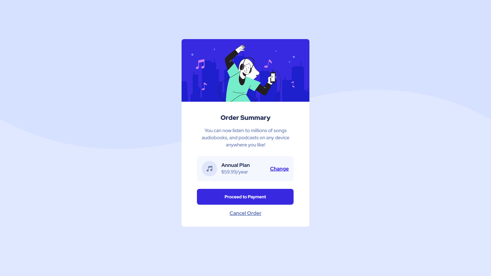

# Frontend Mentor - Order summary card solution

This is a solution to the [Order summary card challenge on Frontend Mentor](https://www.frontendmentor.io/challenges/order-summary-component-QlPmajDUj). Frontend Mentor challenges help you improve your coding skills by building realistic projects. 

## Table of contents

- [Overview](#overview)
  - [Screenshot](#screenshot)
  - [Links](#links)
  - [Built with](#built-with)
- [Author](#author)

## Overview

  Order Summary Card was my second project. really learned new thing, was a great experience building. It really taught me a lot of things such as, Flexbox, media queries, and much more,  There are some things that I have to look into them. and practice with them. 

### Screenshot

### Links

- Solution URL: [https://www.frontendmentor.io/solutions/order-summary-component-main-6sgWYW54Ho](https://www.frontendmentor.io/solutions/order-summary-component-main-6sgWYW54Ho)
- Live Site URL: [https://order-summery-component-project-2.vercel.app/?vercelToolbarCode=UjhHksQZ9pWQ7R_](https://order-summery-component-project-2.vercel.app/?vercelToolbarCode=UjhHksQZ9pWQ7R_)

### Built with

- Semantic HTML5 markup
- CSS custom properties
- Flexbox
- Media Queries

## Author

- Frontend Mentor - [@AmeerHamza838](https://www.frontendmentor.io/profile/AmeerHamza838)
- Twitter - [@ameer1hamza24](https://www.twitter.com/ameer1hamza24)
